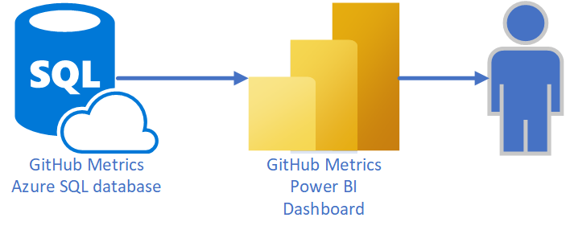
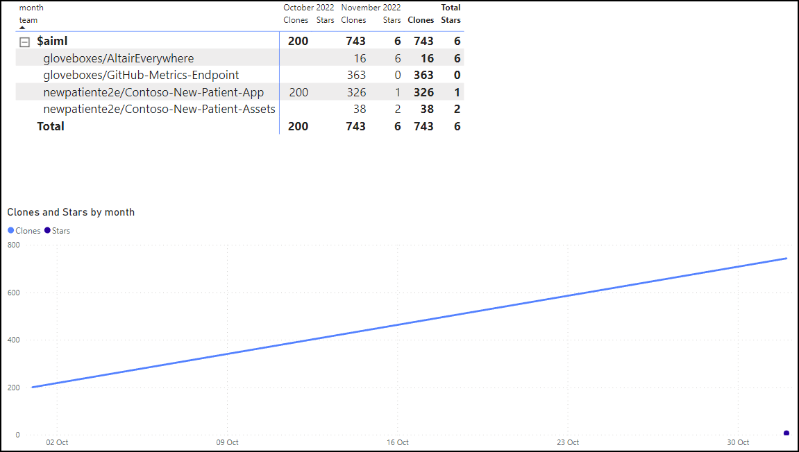

# Reporting with Power BI

GitHub metrics are stored in an Azure SQL database. Power BI is used to visualize the metrics data.

A basic Power BI report is provided with this solution. The report is a starting point for you to create your own reports. To get started with the Power BI report, follow these instructions.

1. Download [Power BI Desktop](https://powerbi.microsoft.com/en-us/desktop).
1. Open the Power BI report from the **power_bi** folder in the solution.
1. From the Power BI Desktop, select **File**, then **Options and settings**.
1. Select **Data source settings**.
1. Select **Change source**. You will need:
    1. The Azure SQL server address.
    1. The Azure SQL database name (default is **github-metrics**).
    1. Select **OK** to save the changes.
1. Next, select **Edit Permissions**, and select **Edit**, you will need:
    1. The Azure SQL database username (set when you deployed the GitHub metrics solution).
    1. The Azure SQL database password (set when you deployed the GitHub metrics solution).
    1. 1. Select **OK** to save the changes.
1. Select **Close** to close the **Data source settings** dialog.

## Refreshing the report data

From the Power BI Desktop, select **Refresh** from the ribbon to refresh the report data.
